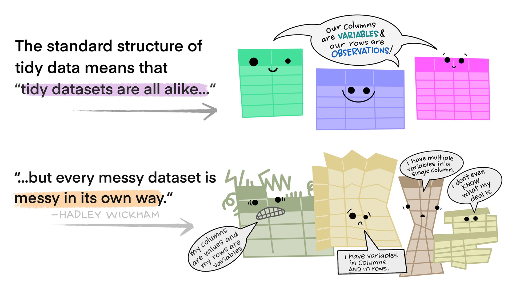
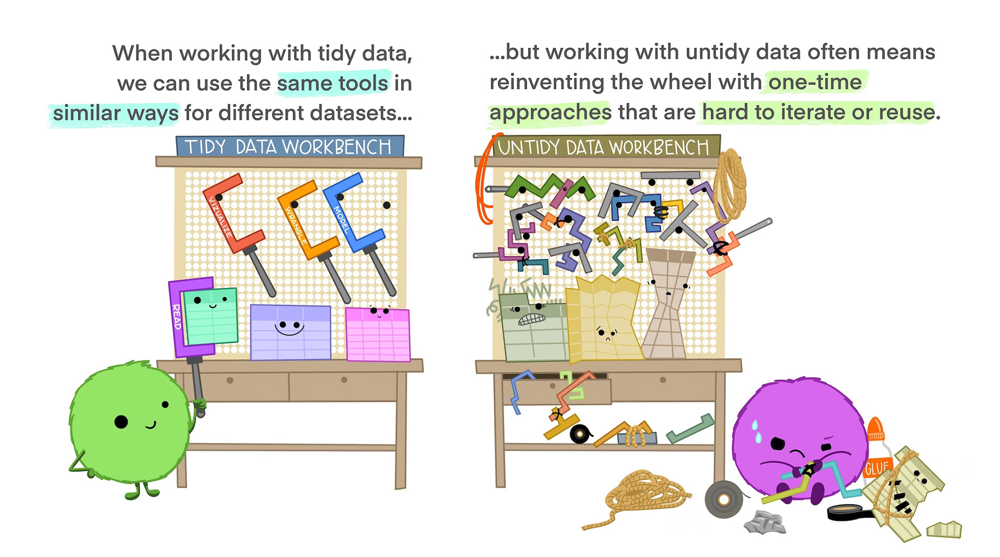

# Reshaping and pivots

```{r}
#| include: false

# settings, placed in a chunk that will not show in the .html file (because include=FALSE) 

# disables scientific notation so that small numbers appear as eg "0.00001" rather than "1e-05"
options(scipen = 999)  

```

## Tidy data explainer

'Tidy Data' is a set of technical ideas about how data should be structured ([Wickham, 2014](https://www.jstatsoft.org/article/view/v059i10/0)). The original article is very much worth reading, as it emphasizes that data processing is part of the data analysis workflow - not only in a procedural sense, but in the cognitive sense that data processing and shaping is a representation of what research questions and analyses can be conducted.

There are three rules that make a dataset tidy according to [Wickham (2023)](https://r4ds.hadley.nz/data-tidy.html#sec-tidy-data):

- Each variable is a column; each column is a variable.
- Each observation is a row; each row is an observation.
- Each value is a cell; each cell is a single value.

Read [Wickham's chapter on Tidy Data](https://r4ds.hadley.nz/data-tidy.html#sec-tidy-data) in the second edition of R4DS. His visualizations are useful, but unfortunately the license he uses means I can't directly include them in this book.

Alison Horst has created some infographics that explain its simplest elements well:







## Examples of more and less Tidy Data

`table1` is tidiest, and therefore easiest to work with within many workflows, because it adheres to the above rules. To see this in action, try to calculate a percentage prevalence (cases/population) using each dataset.

```{r}

library(tidyverse)
library(knitr)
library(kableExtra)

table1 %>%
  kable() %>%
  kable_classic(full_width = FALSE)

table2 %>%
  kable() %>%
  kable_classic(full_width = FALSE)

table3 %>%
  kable() %>%
  kable_classic(full_width = FALSE)

```

#### Check your learning

Why do table2 and table3 not as Tidy as table1? 

## Non-tidy data

There are many forms of data that are non-tidy without being messy. A proper understanding of Tidy Data requires that you understand this distinction. See [Wickham's description](https://r4ds.had.co.nz/tidy-data.html#non-tidy-data) in the first edition of the R4DS book. 

## There is no one Tidy to rule them all

The same data can be represented in many different ways and still be Tidy: it can be wider or longer.

```{r}

# pivot table2 to a wider format to create table1
table2 %>%
  pivot_wider(names_from = type,
              values_from = count) %>%
  kable() %>%
  kable_classic(full_width = FALSE)

# compare to table1
table1 %>%
  kable() %>%
  kable_classic(full_width = FALSE)

```

This gif helps illustrate what's happening when you pivot data to be wider or longer ([source](https://github.com/gadenbuie/tidyexplain?tab=readme-ov-file#pivot-wider-and-longer)):


## Example

### Simulate data in wide format

```{r}
#| include: false

library(tidyverse)
library(janitor)
library(knitr)
library(kableExtra)

# generate some messy demographics data with a larger N
# devtools::install_github("ianhussey/truffle")
library(truffle)

dat_likert_wide <- 
  truffle_likert(study_design = "crosssectional",
                 n_per_condition = 50,
                 factors  = c("X1_latent", "X2_latent"),
                 prefixes = c("depression1_item", "depression2_item"),
                 alpha = c(.70, .70),
                 n_items = c(10, 7),
                 n_levels = 7,
                 r_among_outcomes = 0.80,
                 seed = 42) %>% 
  truffle_demographics()
```

### Cronbach's alpha

Wide data like this is a) common and b) useful for calculating metrics like internal consistency.

```{r}

res_alpha_depression1 <- dat_likert_wide %>%
  select(starts_with("depression1_")) %>%
  psych::alpha()

cronbachs_depression1_alpha <- res_alpha_depression1$total$raw_alpha |>
  round_half_up(digits = 2)


res_alpha_depression2 <- dat_likert_wide %>%
  select(starts_with("depression2_")) %>%
  psych::alpha()

cronbachs_depression2_alpha <- res_alpha_depression2$total$raw_alpha |>
  round_half_up(digits = 2)

```

Cronbach's $\alpha$s: 

- Depression1 scale: `r cronbachs_depression1_alpha`
- Depression1 scale: `r cronbachs_depression2_alpha`

### Plot simulated data

```{r}

ggplot(dat_likert_wide, aes(x = depression1_item1)) +
  geom_histogram(binwidth = 1, boundary = -0.5) +
  theme_linedraw()

ggplot(dat_likert_wide, aes(x = depression1_item2)) +
  geom_histogram(binwidth = 1, boundary = -0.5) +
  theme_linedraw()

ggplot(dat_likert_wide, aes(x = depression1_item3)) +
  geom_histogram(binwidth = 1, boundary = -0.5) +
  theme_linedraw()

ggplot(dat_likert_wide, aes(x = depression1_item4)) +
  geom_histogram(binwidth = 1, boundary = -0.5) +
  theme_linedraw()

ggplot(dat_likert_wide, aes(x = depression1_item5)) +
  geom_histogram(binwidth = 1, boundary = -0.5) +
  theme_linedraw()

ggplot(dat_likert_wide, aes(x = depression1_item6)) +
  geom_histogram(binwidth = 1, boundary = -0.5) +
  theme_linedraw()

ggplot(dat_likert_wide, aes(x = depression1_item7)) +
  geom_histogram(binwidth = 1, boundary = -0.5) +
  theme_linedraw()

ggplot(dat_likert_wide, aes(x = depression1_item8)) +
  geom_histogram(binwidth = 1, boundary = -0.5) +
  theme_linedraw()

ggplot(dat_likert_wide, aes(x = depression1_item9)) +
  geom_histogram(binwidth = 1, boundary = -0.5) +
  theme_linedraw()

ggplot(dat_likert_wide, aes(x = depression1_item10)) +
  geom_histogram(binwidth = 1, boundary = -0.5) +
  theme_linedraw()


ggplot(dat_likert_wide, aes(x = depression2_item1)) +
  geom_histogram(binwidth = 1, boundary = -0.5) +
  theme_linedraw()

ggplot(dat_likert_wide, aes(x = depression2_item2)) +
  geom_histogram(binwidth = 1, boundary = -0.5) +
  theme_linedraw()

ggplot(dat_likert_wide, aes(x = depression2_item3)) +
  geom_histogram(binwidth = 1, boundary = -0.5) +
  theme_linedraw()

ggplot(dat_likert_wide, aes(x = depression2_item4)) +
  geom_histogram(binwidth = 1, boundary = -0.5) +
  theme_linedraw()

ggplot(dat_likert_wide, aes(x = depression2_item5)) +
  geom_histogram(binwidth = 1, boundary = -0.5) +
  theme_linedraw()

ggplot(dat_likert_wide, aes(x = depression2_item6)) +
  geom_histogram(binwidth = 1, boundary = -0.5) +
  theme_linedraw()

ggplot(dat_likert_wide, aes(x = depression2_item7)) +
  geom_histogram(binwidth = 1, boundary = -0.5) +
  theme_linedraw()

```

-   These plots repeat the mortal coding sin of repeating ourselves. If we reshaped the data to 'long' format we could use just one ggplot() call that includes facet_wrap().

### `pivot_longer()`

Using `pivot_longer()`.

```{r}
dat_likert_long <- dat_likert_wide %>%
  pivot_longer(cols = starts_with("depression"),
               names_to = "scale_item",
               values_to = "response")

ggplot(dat_likert_long, aes(x = response)) +
  geom_histogram(binwidth = 1, boundary = -0.5) +
  theme_linedraw() +
  facet_wrap(~ scale_item)
```

What other ways could you specify this `pivot_longer()`'s `cols` argument through negative selection?

```{r}
#| eval: false
#| include: false

# negative selection
## write your pivot code here  


# use the same plotting code:
ggplot(dat_likert_long, aes(x = response)) +
  geom_histogram(binwidth = 1, boundary = -0.5) +
  theme_linedraw() +
  facet_wrap(~ scale_item)


```

```{r}
# answer: negative selection
dat_likert_long <- dat_likert_wide %>%
  pivot_longer(cols = c(-id, -gender, -age),
               names_to = "scale_item",
               values_to = "response")

ggplot(dat_likert_long, aes(x = response)) +
  geom_histogram(binwidth = 1, boundary = -0.5) +
  theme_linedraw() +
  facet_wrap(~ scale_item)
```

#### Check your learning

Why is dat_likert_long not as tidy as it could be?

```{r}

dat_likert_long 

```

### `seperate()`

```{r}
#| fig-height: 8
#| fig-width: 6
library(tidyr)

dat_likert_long_tidy <- dat_likert_wide %>%
  pivot_longer(cols = starts_with("depression"),
               names_to = "scale_item",
               values_to = "response") %>%
  separate(scale_item, into = c("scale", "item"), sep = "_")

ggplot(dat_likert_long_tidy, aes(x = response)) +
  geom_histogram(binwidth = 1, boundary = -0.5) +
  theme_linedraw() +
  facet_grid(item ~ scale)
```

## Practice `mutate()`

The above plot does not order the items correctly (item1, item10, item2, etc).

Use `mutate()` to remove 'depression' and 'item' from the column contents and plot it again.

```{r}


```

### More advanced `pivot_longer()` 

Separation can be done inside pivots.

```{r}
#| fig-height: 8
#| fig-width: 6
dat_likert_long_tidy3 <- dat_likert_wide %>%
  pivot_longer(cols = starts_with("depression"),
               names_to = c("scale", "scale_num", "item"),
               names_pattern = "(depression)(\\d+)_item(\\d+)",
               names_transform = list(item = as.integer),
               values_to = "response")

ggplot(dat_likert_long_tidy3, aes(x = response)) +
  geom_histogram(binwidth = 1, boundary = -0.5) +
  theme_linedraw() +
  facet_grid(item ~ scale_num)
```

```{r}

dat_meta <- readr::read_csv("../data/processed/dat_meta.csv") |>
  select(-comparison, -score_range, -min, -max)

dat_meta

dat_meta |>
  pivot_longer(
    cols = c(mean_trt, sd_trt, n_trt, mean_ctrl, sd_ctrl, n_ctrl),
    names_to = c(".value", "condition"),
    names_pattern = "(mean|sd|n)_(trt|ctrl)"
  )


dat_meta_trt <- dat_meta |>
  select(study, mean = mean_trt, sd = sd_trt, n = n_trt) |>
  mutate(condition = "trt")

dat_meta_ctrl <- dat_meta |>
  select(study, mean = mean_ctrl, sd = sd_ctrl, n = n_ctrl) |>
  mutate(condition = "ctrl")

dat_binded <- bind_rows(
  dat_meta_trt,
  dat_meta_ctrl
) |>
  arrange(study)

dat_binded |>
  count(study, name = "conditions_per_study") |>
  count(conditions_per_study) |>
  arrange(desc(n))

check1 <- dat_binded |>
  group_by(study) |>
  summarize(conditions_per_study = n()) |>
  mutate(check = conditions_per_study == 2) |>
  summarize(all_ok = mean(check)) |>
  pull(all_ok)

  #summarize(check = mean(conditions_per_study == 2))

full_join(
  dat_meta_trt,
  dat_meta_ctrl,
  by = c("study", "mean", "sd", "n", "condition")
)

```

Do all studies have 2 conditions? `r as.logical(check1)`

### Practice `pivot_longer()` and other functions to calculate sum scores

Calculate the mean and SD of each item. Do not repeat your code: use pivot_longer and other functions. 

```{r}

dput(colnames(dat_likert_wide))

dat_likert_wide %>%
summarize(
mean_depression1_item1 = mean(depression1_item1),
mean_depression1_item2 = mean(depression1_item2),
mean_depression1_item3 = mean(depression1_item3),
mean_depression1_item4 = mean(depression1_item4),
mean_depression1_item5 = mean(depression1_item5),
mean_depression1_item6 = mean(depression1_item6),
mean_depression1_item7 = mean(depression1_item7),
mean_depression1_item8 = mean(depression1_item8),
mean_depression1_item9 = mean(depression1_item9),
mean_depression1_item10 = mean(depression1_item10),
mean_depression2_item1 = mean(depression2_item1),
mean_depression2_item2 = mean(depression2_item2),
mean_depression2_item3 = mean(depression2_item3),
mean_depression2_item4 = mean(depression2_item4),
mean_depression2_item5 = mean(depression2_item5),
mean_depression2_item6 = mean(depression2_item6),
mean_depression2_item7 = mean(depression2_item7),

sd_depression1_item1 = sd(depression1_item1),
sd_depression1_item2 = sd(depression1_item2),
sd_depression1_item3 = sd(depression1_item3),
sd_depression1_item4 = sd(depression1_item4),
sd_depression1_item5 = sd(depression1_item5),
sd_depression1_item6 = sd(depression1_item6),
sd_depression1_item7 = sd(depression1_item7),
sd_depression1_item8 = sd(depression1_item8),
sd_depression1_item9 = sd(depression1_item9),
sd_depression1_item10 =sd(depression1_item10),
sd_depression2_item1 = sd(depression2_item1),
sd_depression2_item2 = sd(depression2_item2),
sd_depression2_item3 = sd(depression2_item3),
sd_depression2_item4 = sd(depression2_item4),
sd_depression2_item5 = sd(depression2_item5),
sd_depression2_item6 = sd(depression2_item6),
sd_depression2_item7 = sd(depression2_item7)
)

dat_likert_wide %>%
  pivot_longer(cols = starts_with("depression"),
               names_to = c("scale", "scale_num", "item"),
               names_pattern = "(depression)(\\d+)_item(\\d+)",
               names_transform = list(item = as.integer),
               values_to = "response") %>%
  group_by(scale, item) |>
summarize(mean = mean(response),
sd = sd(response))

```

Now calculate:

1. Each participant's mean score on each scale - **without** using item1+item2+item3 etc; use a pivot first.
2. The sample's mean and SD on each scale
3. Plot participants' mean-scores on each scale 

```{r}

# dat_likert_long_meanscored <- dat_likert_wide


# ggplot(dat_likert_long_meanscored, aes(x = meanscore)) +
#   geom_histogram(binwidth = 1, boundary = -0.5) +
#   theme_linedraw() +
#   facet_wrap(~ scale)

```

## `pivot_wider()` 

pivot_wider is the opposite to pivot_longer. Note that it requires an id column(s) to know which rows below to the same participants.

```{r}

# built in dataset, long format
cms_patient_experience

# convert to wider, but lacks id column
cms_patient_experience |> 
  pivot_wider(
    names_from = measure_cd,
    values_from = prf_rate
  )

# convert to wider, with id column correctly specified
cms_patient_experience |> 
  pivot_wider(
    id_cols = starts_with("org"),
    names_from = measure_cd,
    values_from = prf_rate
  )

```

Convert our mean-scored data from longer format back to wider:

```{r}

# dat_likert_wide_meanscored <- dat_likert_long_meanscored %>%
#   pivot_wider(names_from = scale,
#               values_from = meanscore)

```

## Practice `pivot_wider()` more

Wrangle the demographics data from one of the early chapters to calculate the sample size, the M and SD age, and the counts of each gender. 

Before, we used filter() to wrangle the age and gender data separately. This time, reshape it using a pivot.

```{r}

dat_demographics_raw <- read_csv("../data/raw/data_demographics_raw.csv")


```

### Practice `pivot_wider()` and other functions

The Affect Misattribution Procedure (AMP) claims to be a measure of automatic evaluations of stimuli without the participants intention or awareness (Payne et al., 2013). This data comes from an AMP study where participants are asked to evaluate Chinese characters and ignore the picture stimuli that are briefly presented before each Chinese character. The AMP effect is quantified as the difference in the ratings of the Chinese characters preceeded by one stimulus type (positive) vs. the other (negative). The idea is that participants should not evaluate the images, only the Chinese characters, but the images nonetheless influence their evaluations.  

- Remove the instructions trials and the practice trials.
- Create an 'evaluation' variable. When the stimulus was prime_positive, 'evaluation' = 'correct'. When stimulus was prime_negative, 'evaluation' is 'correct' reverse scored.
- Calculate the mean evaluation per stimulus type (positive vs negative)
- Pivot the data wider so that you have mean_evaluation_positive and mean_evaluation_negative.
- Calculate the `amp_effect` for each participant: the difference in mean evaluations of the positive vs. negative stimuli. 
- Create a separate data frame with the mean and SD of the amp_effect in the sample. If mean evaluation deviates from 0.5 (neutral), and AMP effect is present.

```{r}

dat_amp <- read_csv("../data/raw/data_amp_raw.csv")


```

## Advanced `pivot_longer()`

Sometimes we want to pivot multiple columns at once. This too is possible.

```{r}

# wider data
household

# longer data
household |> 
  pivot_longer(
    cols = !family, 
    names_to = c(".value", "child"), # values come from .value placeholder
    names_sep = "_", 
    values_drop_na = TRUE
  )

```


