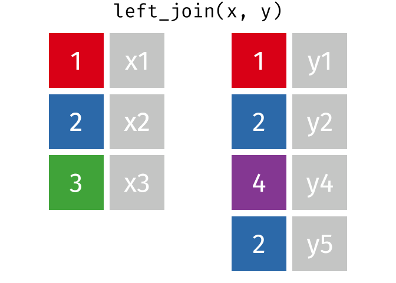
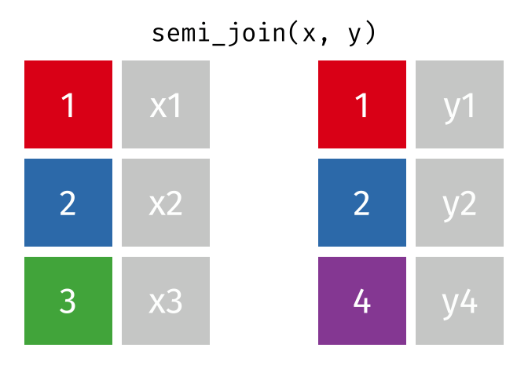

# Binding and joining

```{r}
#| include: false

# settings, placed in a chunk that will not show in the .html file (because include=FALSE) 

# disables scientific notation so that small numbers appear as eg "0.00001" rather than "1e-05"
options(scipen = 999)  

```

## Dependencies

```{r}

library(tidyverse)
library(janitor)
library(knitr)
library(kableExtra)

```

## Simluate data

```{r}
#| include: false
# devtools::install_github("ianhussey/truffle")
library(truffle)

dat_likert_wide <- 
  truffle_likert(study_design = "crosssectional",
                 n_per_condition = 8,
                 factors  = c("X1_latent", "X2_latent"),
                 prefixes = c("depression1_item", "depression2_item"),
                 alpha = c(.70, .70),
                 n_items = c(10, 7),
                 n_levels = 7,
                 r_among_outcomes = 0.80,
                 seed = 43) %>% 
  truffle_demographics()
```

## Practice pivoting and summarizing

- Create a data frame that contains the id, gender and age data.
  - No pivot needed.
- Create a separate data frame with the id and sum scores with each participants' scores on each depression scale.
  - Convert the wide data to long.
  - Calculate a mean score for each participant and each of the scales.
  - Covert the data back to wider so that it's one row per participant.

```{r}


```


::: {.callout-note collapse="true" title="Click to show answer"}
```{r}
dat_demographics <- dat_likert_wide %>%
  # select rows of interest
  select(id, age, gender) 

dat_likert_scored <- dat_likert_wide %>%
  # pivot longer
  pivot_longer(cols = starts_with("depression"),
               names_to = "scale_item",
               values_to = "response") %>%
  # separate scale_item into scale and item
  separate(scale_item, into = c("scale", "item"), sep = "_") %>%
  # calculate sum scores for each participant and scale
  group_by(id, scale) %>%
  summarize(mean_score = mean(response)) %>%
  ungroup() %>%
  # pivot wider
  pivot_wider(names_from = "scale",
              values_from = "mean_score") 
```
:::

::: {.callout-note collapse="true" title="Click to show answer"}
```{r}
# alternative solution
dat_demographics <- dat_likert_wide %>%
  # select rows of interest
  select(id, age, gender) 

dat_likert_scored <- dat_likert_wide %>%
  # pivot longer
  pivot_longer(cols = starts_with("depression"),
               names_to = c("scale", "item"),
               names_sep = "_",
               values_to = "response") %>%
  # calculate sum scores for each participant and scale
  summarize(mean_score = mean(response), 
            .by = c("id", "scale")) %>%
  # pivot wider
  pivot_wider(names_from = "scale",
              values_from = "mean_score") 
```
::: 

## Combining datasets

### Why `cbind()`/`bind_cols()` and `rbind()`/`bind_rows()` should be avoided

- `cbind()`/`rbind()`: Base R
- `bind_cols()`/`bind_rows()`: tidyverse, but still not preferred.

From the `bind_cols()` documentation: "Where possible prefer using a join to combine multiple data frames. bind_cols() binds the rows in order in which they appear so it is easy to create meaningless results without realising it."

#### Row mismatches

```{r}
# shuffle the rows
set.seed(42)

dat_demographics_shuffled <- dat_demographics %>%
  # randomise rows to make combination more difficult
  sample_frac(size = 1, replace = FALSE)

dat_likert_scored_shuffled <- dat_likert_scored %>%
  # randomise rows to make combination more difficult
  sample_frac(size = 1, replace = FALSE)

# bind columns
dat_combined_cbind <- cbind(dat_demographics_shuffled,
                            dat_likert_scored_shuffled)

dat_combined_bind_cols <- bind_cols(dat_demographics_shuffled,
                                    dat_likert_scored_shuffled)

head(dat_combined_bind_cols, n = 8)
```

Why is this dangerous?

#### Invisible row mismatches

Without unique IDs, its not even obvious anything has gone wrong.

```{r}
dat_demographics_shuffled2 <- dat_demographics_shuffled %>%
  select(-id)

dat_likert_scored_shuffled2 <- dat_likert_scored_shuffled %>%
  select(-id)

dat_combined_bind_cols2 <- bind_cols(dat_demographics_shuffled2,
                                     dat_likert_scored_shuffled2)

head(dat_combined_bind_cols2, n = 8)
```

#### More severe row mismatches throw errors 

```{r}
# shuffle the rows and add duplicates or missingness
set.seed(42)

dat_demographics_shuffled_missing <- dat_demographics %>%
  # add errors in the form of missing data, plus randomise rows 
  sample_frac(size = 0.75, replace = FALSE)

dat_likert_scored_shuffled_duplicates <- dat_likert_scored %>%
  # add errors in the form of duplicates
  dirt_duplicates(prop = 0.25) %>%
  # randomise rows to make combination more difficult
  sample_frac(size = 1, replace = FALSE)
```

```{r}
dat_demographics_shuffled_missing %>%
  count()

dat_likert_scored_shuffled_duplicates %>%
  count()
```

```{r}
dat_demographics_shuffled_missing %>%
  as_tibble() %>%
  select(id) %>%
  head(n = 10)

dat_likert_scored_shuffled_duplicates %>%
  select(id) %>%
  head(n = 10)
```

```{r}
#| eval: false
#| include: true
dat_combined_cbind <- cbind(dat_demographics_shuffled_missing,
                            dat_likert_scored_shuffled_duplicates)

dat_combined_bind_cols <- bind_cols(dat_demographics_shuffled_missing, 
                                    dat_likert_scored_shuffled_duplicates)
```

## Joins

Intelligently join two data frames together using one or more reference columns.

### Mutating joins

#### `full_join()`

All rows and all columns from both x and y. Where there are not matching values, returns NA for the one missing.

```{r}
knitr::include_graphics("../images/join_full.gif")
```

```{r}
dat_full_join <- full_join(x = dat_demographics_shuffled_missing, 
                           y = dat_likert_scored_shuffled_duplicates,
                           by = "id")

dat_demographics_shuffled_missing %>% 
  head(n = 10) %>%
  arrange(id)

dat_likert_scored_shuffled_duplicates %>% 
  head(n = 10) %>%
  arrange(id)

dat_full_join %>% 
  head(n = 10) %>%
  arrange(id)
```

What is participant 5's age and depression1 score? Are they correct in the joined dataset?

What issues still remain?

#### `left_join()`

All rows from x, and all columns from x and y. Rows in x with no match in y will have NA values in the new columns.

```{r}
knitr::include_graphics("../images/join_left.gif")
```

```{r}

```

```{r}
dat_full_left <- left_join(x = dat_demographics_shuffled_missing, 
                           y = dat_likert_scored_shuffled_duplicates,
                           by = "id")

dat_demographics_shuffled_missing %>% 
  head(n = 10) %>%
  arrange(id)

dat_likert_scored_shuffled_duplicates %>% 
  head(n = 10) %>%
  arrange(id)

dat_full_left %>% 
  head(n = 10) %>%
  arrange(id)
```

#### `right_join()`

All rows from y, and all columns from x and y. Rows in y with no match in x will have NA values in the new columns.

```{r}
knitr::include_graphics("../images/join_right.gif")
```

```{r}
dat_full_right <- right_join(x = dat_demographics_shuffled_missing, 
                             y = dat_likert_scored_shuffled_duplicates,
                             by = "id")

dat_demographics_shuffled_missing %>% 
  head(n = 10) %>%
  arrange(id)

dat_likert_scored_shuffled_duplicates %>% 
  head(n = 10) %>%
  arrange(id)

dat_full_right %>% 
  head(n = 10) %>%
  arrange(id)
```

#### `inner_join()`

All rows from x where there are matching values in y, and all columns from x and y.

Note that an inner join is both left and right.

```{r}
knitr::include_graphics("../images/join_inner.gif")
```

```{r}
dat_full_inner <- inner_join(x = dat_demographics_shuffled_missing, 
                             y = dat_likert_scored_shuffled_duplicates,
                             by = "id")

dat_demographics_shuffled_missing %>% 
  head(n = 10) %>%
  arrange(id)

dat_likert_scored_shuffled_duplicates %>% 
  head(n = 10) %>%
  arrange(id)

dat_full_inner %>% 
  head(n = 10) %>%
  arrange(id)
```

### Filtering joins

#### `semi_join()`

All rows from x where there are matching values in y, keeping just columns from x.

```{r}

```

```{r}
dat_semi <- semi_join(x = dat_demographics_shuffled_missing, 
                           y = dat_likert_scored_shuffled_duplicates,
                           by = "id")

dat_demographics_shuffled_missing %>% 
  head(n = 10) %>%
  arrange(id)

dat_likert_scored_shuffled_duplicates %>% 
  head(n = 10) %>%
  arrange(id)

dat_semi %>% 
  head(n = 10) %>%
  arrange(id)
```

#### `anti_join()`

All rows from x where there are **not** matching values in y, keeping just columns from x.

```{r}
knitr::include_graphics("../images/join_anti.gif")
```

```{r}
dat_full_anti <- anti_join(x = dat_likert_scored_shuffled_duplicates, 
                           y = dat_demographics_shuffled_missing,
                           by = "id")

dat_demographics_shuffled_missing %>% 
  head(n = 10) %>%
  arrange(id)

dat_likert_scored_shuffled_duplicates %>% 
  head(n = 10) %>%
  arrange(id)

dat_full_anti %>% 
  head(n = 10) %>%
  arrange(id)
```

### Why not use `full_join()` for almost everything?

```{r}
# shuffle the rows and add duplicates or missingness
set.seed(42)

dat_demographics_many_duplicates <- dat_demographics  %>%
  # add errors in the form of duplicates
  dirt_duplicates(prop = 1) 

dat_likert_scored_many_duplicates <- dat_likert_scored %>%
  # add errors in the form of duplicates
  dirt_duplicates(prop = 1) 
```

```{r}
dat_full_join2 <- full_join(x = dat_demographics_many_duplicates, 
                           y = dat_likert_scored_many_duplicates,
                           by = "id")

dat_demographics_many_duplicates %>%
  count()

dat_likert_scored_many_duplicates %>%
  count()

dat_full_join2 %>% 
  count()
```

## Exercises 1

Using the existing demographics and Likert data frames:

1. How can you keep all rows from the Likert data where there are matching values in demographics data, keeping just columns from Likert data? How many rows are there? Are there duplicates?

```{r}


```

2. How can you keep all rows from the demographics where there are **not** matching values in Likert data, keeping just columns from demographics? How many rows are there? Are there duplicates?

```{r}


```

3. How can you use `full_join()` and then a) quantify and b) handle duplicate values? 

Hint: we covered a functions to do this in the chapters Data Transformation 1 and Data Transformation 3.

Which columns would you apply these functions to and how? What if your dataset had a lot more columns?

```{r}


```

## Exercises 2

Simulated data for a mixed within-between Randomized Controlled Trials examining the effect of an intervention on self-reported social media use. Hypothetically, data was collected before and after intervention, in both an intervention and placebo (waiting list control) group.

Four data sets are created: 

- demographics
- scores at pre
- scores at post 
- participants to be excluded 

```{r}
set.seed(42)

dat_demographics <- 
  tibble(id = 1:50) %>%
  truffle_demographics()  %>%
  # randomise row order
  sample_frac(size = 1, replace = FALSE) %>%
  # add duplicates
  dirt_duplicates(prop = .30)

dat_pre <- 
  truffle_likert(study_design = "factorial_between2",
                 n_per_condition = 25,
                 factors  = "X1_latent",
                 prefixes = "socialmediause_item",
                 alpha = .80,
                 n_items = 2,
                 n_levels = 7,
                 approx_d_between_groups = 0,
                 seed = 42) %>%
  # select just the first social media item, 
  # to mimic a 1-item measure. 
  # truffle_likert() has to create at least two items, so this is a workaround.
  select(id, condition, socialmediause_pre = socialmediause_item1) %>%
  # randomise row order
  sample_frac(size = 1, replace = FALSE) 

dat_post <- 
  truffle_likert(study_design = "factorial_between2",
                 n_per_condition = 25,
                 factors  = "X1_latent",
                 prefixes = "socialmediause_item",
                 alpha = .80,
                 n_items = 2,
                 n_levels = 7,
                 approx_d_between_groups = 0.4,
                 seed = 42) %>%
  # select just the first social media item, 
  # to mimic a 1-item measure. 
  # truffle_likert() has to create at least two items, so this is a workaround.
  select(id, condition, socialmediause_post = socialmediause_item1) %>%
  # delete some rows to create missingness
  sample_frac(size = .75, replace = FALSE) %>%
  # randomise row order
  sample_frac(size = 1, replace = FALSE) 

dat_exclusions <- tibble(id = c(3, 11, 12))
```

1. Join together the four data frames to create a data frame named `data_combined`

- Use only `join` functions (i.e., not filter or distinct etc.).
- Note that you must (sometimes) join by two variables this time, id and condition, to retain both of them without creating two condition variables. 
- data_combined should contain all participants that have data at timepoint pre, with missing (NA) data for timepoint post.
- data_combined should also include age and gender data, but without introducing duplicates.
- data_combined should also **not** include participant IDs that are present in dat_exclusions.

```{r}


```

If correctly joined, you could be able to run the next chunk to analyze the RCT data following best practices for RCTs, i.e., an ANCOVA comparing differences at post controlling for differences at pre, estimating the effect size using Morris' (2008) version of Cohen's d, d_ppc2 and its 95% Confidence Intervals.

```{r}
#| eval: false
#| include: true
fit <- lm(formula = socialmediause_post ~ socialmediause_pre + condition,
          data = dat_combined)

car::Anova(fit, type = 3) |>
  report::report()
```

## Exercises 3

```{r}
set.seed(42)

dat_demographics <- 
  tibble(id = 1:50) %>%
  truffle_demographics()  %>%
  # randomise row order
  sample_frac(size = 1, replace = FALSE) %>%
  # add duplicates
  dirt_duplicates(prop = .30)

dat_purchases_store_1 <-
  tibble(id = 1:50,
         purchases_store1 = rnbinom(n = 50, size = 2, mu = 3)) %>%
  select(id, purchases_store1) %>%
  # delete some rows to create missingness
  sample_frac(size = .75, replace = FALSE) %>%
  # randomise row order
  sample_frac(size = 1, replace = FALSE) 

dat_purchases_store_2 <-
  tibble(id = 1:50,
         purchases_store2 = rnbinom(n = 50, size = 2, mu = 1.5)) %>%
  select(id, purchases_store2) %>%
  # delete some rows to create missingness
  sample_frac(size = .60, replace = FALSE) %>%
  # randomise row order
  sample_frac(size = 1, replace = FALSE) 

dat_purchases_store_3 <-
  tibble(id = 1:50,
         purchases_store3 = rnbinom(n = 50, size = 2.1, mu = 1.75)) %>%
  select(id, purchases_store3) %>%
  # delete some rows to create missingness
  sample_frac(size = .40, replace = FALSE) %>%
  # randomise row order
  sample_frac(size = 1, replace = FALSE) 
```


