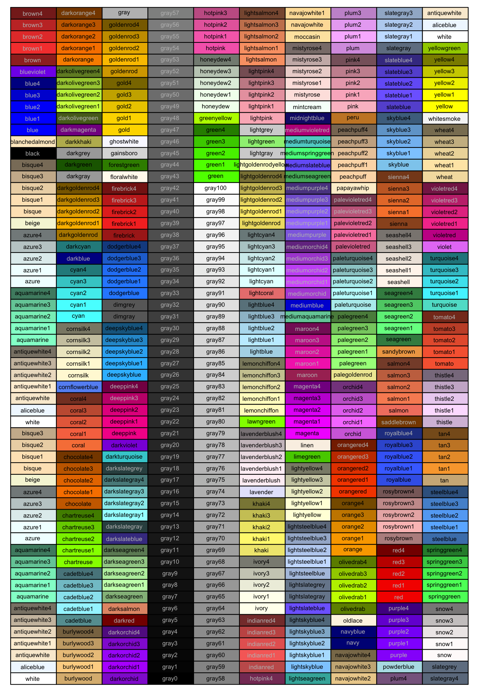

```{r, include=FALSE}
# set knit options
knitr::opts_chunk$set(message = FALSE,
                      warning = FALSE)

# disable scientific notation
options(scipen = 999) 

# create plots director
dir.create("plots")
```

This chapter covers the basics of {ggplot2}, the tidyverse plotting library, which is based on Hadley Wickam's [The Grammar of Graphics](https://vita.had.co.nz/papers/layered-grammar.html). 

Wickham, Navarro, and Lin Pedersen have written an entire open source ebook about ggplot, the [ggplot2 book](https://ggplot2-book.org/), that is far more detailed than this chapter. I recommend you start with the [The Grammar](https://ggplot2-book.org/mastery.html) chapter.

## Why plot data?

Summary statistics aren't enough! These datasets all have nearly identical summary statistics, but very different underlying data.

```{r}
#| include: false

# dependencies
library(readr)
library(ggplot2)
# install.packages("datasauRus")
library(datasauRus) 
library(scales)
library(dplyr)
library(tidyr)
library(plotrix) 

# install.packages("devtools")
# devtools::install_github("matthewbjane/ThemePark")
library(ThemePark)
library(patchwork)
library(janitor)
library(knitr)
library(kableExtra)

```

```{r}

# M and SD
datasaurus_dozen |>
  group_by(dataset) |>
  summarize(mean_x = mean(x),
            sd_x = sd(x),
            mean_y = mean(y),
            sd_y = sd(y)) |>
  mutate_if(is.numeric, round_half_up, digits = 2) |>
  kable(align = 'r')|>
  kable_classic(full_width = FALSE)

# correlation
datasaurus_dozen |>
  group_by(dataset) |>
  summarize(correlation = cor(x, y)) |>
  mutate_if(is.numeric, round_half_up, digits = 2) |>
  kable(align = 'r') |>
  kable_classic(full_width = FALSE)

```

Always plot your data! Even if is only exploratory or used as a sanity check, and only presented in your supplementary materials, this should be part of data analysis process.

```{r fig.height=10, fig.width=10}

ggplot(datasaurus_dozen, aes(x = x, y = y)) +
  geom_point() +
  facet_wrap(~dataset) +
  theme_minimal()

```

## Structure of a ggplot

```{r}
#| include: false
# simulate data
library(truffle)

dat_likert <- 
  truffle_likert(study_design = "crosssectional",
                 n_items   = c(10, 10),
                 alpha     = c(.99, .99),
                 r_among_outcomes = 0.6,
                 n_per_condition = 100, 
                 n_levels  = c(7, 7),
                 seed = 42) |>
  truffle_sum_scores_by_scale() |>
  truffle_demographics(gender_probs = c(male = .4, female = .4, nonbinary = .2),
                       age_min = 18, 
                       age_max = 65) |>
  select(id, age, gender, depression = X1_sum, self_esteem = X2_sum)
```

### Aesthetics

`aes()` is for 'aesthetics' mappings, which describe how variables in the data are mapped to visual properties (aesthetics) of geoms. 

In this case, the x axis is set to the column `self_esteem`, and the y axis is set to the column `depression`.

Because no geoms have been defined yet, nothing is displayed other than the base plot and its axes.

```{r}

p <- ggplot(data = dat_likert, aes(x = self_esteem, y = depression))
p

```

### Geoms

Whereas data processing steps are combined with the pipes (`%>%` and `|>`), ggplot layers are added with `+`. 

We can add the geom `geom_point()` to the plot and print it again. `geom_point()` includes data points for each X-Y coordinate in the data. The `alpha` argument sets the opacity/transparency of the data points: setting it to .5 gives us some indication of overlapping data points.

```{r}

p <- p + geom_point(alpha = 0.5) # make data points partially transparent using alpha < 1
p

```

Note that, behind the scenes, `geom_point()` is a wrapper function for `layer()`: 

```{r}

p + layer(
  geom = "point", 
  stat = "identity",
  position = "identity"
)

```

ggplot [layers](https://ggplot2-book.org/layers.html) geoms on top of one another. 

We can add a second layer with another geom, `geom_smooth()`. When `method = "lm"`, `geom_smooth()` adds a linear regression line and its Standard Error.

```{r}

p <- p + geom_smooth(method = "lm") # linear regression line using lm()
p

```

### Axes

Axis names, scales, labels, and breaks can each be separately controlled using functions such as `scale_x_continuous()` and `scale_y_continuous()`.

```{r}

p <- p + 
  scale_x_continuous(breaks = breaks_pretty(n = 7), name = "Self-esteem") + 
  scale_y_continuous(breaks = breaks_pretty(n = 7), name = "Depression")

p

```

### Themes

Theme can be customised, or a number of built-in theme can be used such as `theme_minimal()` and `theme_linedraw()`.

```{r}

p <- p + theme_linedraw()
p

```

### Combined

We can put all these layers together in one chunks:

```{r}

ggplot(data = dat_likert, aes(x = self_esteem, y = depression)) +
  geom_point(alpha = 0.5) +
  geom_smooth(method = "lm") +
  scale_x_continuous(breaks = breaks_pretty(n = 7), name = "Self-esteem") + 
  scale_y_continuous(breaks = breaks_pretty(n = 7), name = "Depression") +
  theme_linedraw() 

```

## Colors

### Individual colors

Colors can be chosen directly, including many named colors in R. You can also use hex codes via many hex code picker tools that you can google for.



For example:

```{r}

ggplot(data = dat_likert, 
       aes(x = self_esteem, 
           y = depression)) +
  geom_point(alpha = .9, color = "seagreen4") +
  geom_smooth(method = "lm", color = "maroon4") +
  scale_x_continuous(breaks = breaks_pretty(n = 7), name = "Self-esteem") + 
  scale_y_continuous(breaks = breaks_pretty(n = 7), name = "Depression") +
  theme_linedraw() 

```

### Color palettes

Many plots use multiple colors, e.g., one for each group. Entire palettes of colors exist, including those in the popular RColroBrewer package:

```{r}
#| fig-height: 8
#| fig-width: 6
library(RColorBrewer)

display.brewer.all()
```

Example using color brewer:

```{r}

ggplot(data = dat_likert, 
       aes(x = self_esteem, 
           y = depression, 
           color = gender)) + # add gender to the aesthetics call for color
  geom_point(alpha = .9) +
  geom_smooth(method = "lm", alpha = 0.2) + 
  scale_x_continuous(breaks = breaks_pretty(n = 7), name = "Self-esteem") + 
  scale_y_continuous(breaks = breaks_pretty(n = 7), name = "Depression") +
  theme_linedraw() +
  scale_color_brewer(palette = "Set2")  # use brewer for the `color` aesthetic, where the mapped variable is discrete/categorical

```

### Accessibility 

Vision scientists have put a lot of thought into developing and testing various color palettes such as [viridis](https://cran.r-project.org/web/packages/viridis/vignettes/intro-to-viridis.html), which I particularly recommend. 

Viridis is multi color-blind friendly, as well as having the property of "monotonic luminosity", which means that if you print it out in black and white the color gradient still makes sense. 

Example using continuous variable:

```{r}

ggplot(data = dat_likert, 
       aes(x = self_esteem, 
           y = depression, 
           color = depression)) + # add depression to the aesthetics call for color
  geom_point(alpha = .9) +
  geom_smooth(method = "lm", color = "black") + # you can override the global color aesthetic for this geom
  scale_x_continuous(breaks = breaks_pretty(n = 7), name = "Self-esteem") + 
  scale_y_continuous(breaks = breaks_pretty(n = 7), name = "Depression") +
  theme_linedraw() +
  scale_color_viridis_c(direction = -1) # use viridis_c for the `color` aesthetic, where the mapped variable is continuous

```

Example using categorical variable:

```{r}

ggplot(data = dat_likert, 
       aes(x = self_esteem, 
           y = depression, 
           color = gender)) + # add gender to the aesthetics call for color
  geom_point(alpha = .9) +
  geom_smooth(method = "lm", alpha = 0.2) +
  scale_x_continuous(breaks = breaks_pretty(n = 7), name = "Self-esteem") + 
  scale_y_continuous(breaks = breaks_pretty(n = 7), name = "Depression") +
  theme_linedraw() +
  scale_color_viridis_d() # use viridis_d for the `color` aesthetic, where the mapped variable is discrete/categorical

```

Viridis has multiple component palettes to choose from.

```{r}

library(viridis)
library(unikn)

n <- 10  # number of colors

seecol(list(magma = magma(n),
            inferno = inferno(n),
            plasma = plasma(n),
            viridis = viridis(n),
            cividis = cividis(n),
            rocket = rocket(n),
            mako = mako(n)), 
       col_brd = "white", lwd_brd = 4, 
       main = "Viridis color palettes (n = 10 from each)")

```

## Overriding aesthetics and data

Sometimes we want to override the aesthetics we set for the whole plot in the `ggplot()` call for a specific geom. For example, imagine we want to add a vertical line at the mean AMP score:  

```{r}
#| include: false
# get data
data_processed <- read_csv("../data/processed/data_processed.csv")

data_after_exclusions <- data_processed |>
  filter(exclude_amp == "include" & 
           n_items == 3 & 
           gender %in% c("male", "female")) |>
  mutate(age_group = if_else(age < 35, "Age < 40", "Age ≥ 40"))
```

```{r}

ggplot(data = data_after_exclusions,
         aes(x = amp_score)) +
  geom_histogram(binwidth = 0.1) +
  geom_vline(aes(xintercept = mean(amp_score)), # aes() call that applies to just this geom
             linetype = "dotted", 
             color = "magenta", 
             size = .9) + 
  theme_linedraw() 

```

The same applies to data: specific geoms can receive data from other sources via the `data =` argument.

## Plot types and geoms

### Histogram using `geom_histogram()`

#### Simple plot for self-reports

```{r}

ggplot(data = data_after_exclusions,
       aes(x = mean_self_report)) + 
  geom_histogram(binwidth = 1)

```

#### Slightly better plot for self-reports

```{r}

ggplot(data = data_after_exclusions,
       aes(x = mean_self_report)) +
  # more intelligent choices for the binwidth and boundary
  geom_histogram(binwidth = 1, boundary = 0.5) +
  # labeling of the axis points
  scale_x_continuous(breaks = scales::breaks_pretty(n = 7),
                     limits = c(0.5, 7.5)) +
  scale_y_continuous(breaks = seq(0, 60, 10)) +
  theme_linedraw()

```

#### Change binwidth, centre, boundary

With continuous variables, changing the boundary (where the bins start) and the binwidth (or number of bins) can dramatically change the apparent distribution. No one setting is correct as all are technically accurate, but some are more informative or misleading than others.

Boundary:

```{r}

ggplot(data = data_after_exclusions,
       aes(x = amp_score)) +
  geom_histogram(binwidth = 0.1, boundary = 0) +
  theme_linedraw()

ggplot(data = data_after_exclusions,
       aes(x = amp_score)) +
  geom_histogram(binwidth = 0.1, boundary = 0.05) +
  theme_linedraw()

```

Binwidth:

```{r}

ggplot(data = data_after_exclusions,
       aes(x = amp_score)) +
  geom_histogram(binwidth = 0.01, boundary = 0) +
  theme_linedraw()

ggplot(data = data_after_exclusions,
       aes(x = amp_score)) +
  geom_histogram(binwidth = 0.1, boundary = 0) +
  theme_linedraw()

ggplot(data = data_after_exclusions,
       aes(x = amp_score)) +
  geom_histogram(binwidth = 0.25, boundary = 0) +
  theme_linedraw()

```

#### Exercise

Plot for age.

Create a similar plot for the age variable in `data_processed` (ie before exclusions).

```{r}

 

```

### Density plot using `geom_density()`

#### Simple plot for self-reports

```{r}

ggplot(data = data_after_exclusions,
       aes(x = mean_self_report)) +
  geom_density(adjust = 1, # the degree of smoothing can be adjusted here 
               color = "#FF69B4",
               fill = "darkblue", 
               alpha = 0.3) 

```

#### Exercise

Plot for AMP

Make a similar density plot for the AMP.

-   Add a theme.
-   Change the colors.
-   Make the X axis breaks prettier.
-   Name both axis names more clearly.

```{r}


```

### Bar plot using `geom_col()`

Bar plots are bad and usually shouldn't be used. But they are sometimes unavoidable, so here's how to make them.

#### Pre-calculation of the summary statistics

```{r}

library(plotrix)

# create the summary values to be plotted
summary_amp <- data_after_exclusions %>%
  group_by(gender) %>%
  summarize(amp_mean = mean(amp_score),
            amp_se = plotrix::std.error(amp_score))

# plot these values
ggplot(data = summary_amp, 
       aes(x = gender, 
           y = amp_mean)) +
  geom_col() + # equivalent to `geom_bar(stat = "identity")`
  geom_errorbar(aes(ymin = amp_mean - amp_se*1.96,     # mean ± se*1.96 = 95% confidence interval
                    ymax = amp_mean + amp_se*1.96),
                width = 0.2) 

```

#### Calculation of summary stats inside the ggplot call

```{r}

ggplot(data = data_after_exclusions, 
       aes(x = gender, 
           y = amp_score)) +
  stat_summary(fun = mean,
               geom = "bar") +
  stat_summary(fun.data = mean_cl_normal,  # confident intervals
               geom = "errorbar",
               width = 0.2) +
  labs(title = "Means and their 95% CIs",
       x = "Gender",
       y = "Mean AMP score") +
  theme_linedraw() 

```

#### Exercise

Plot for self-reports

Make a similar plot for the self-reports.

-   Use `coord_flip()` to swap the X and Y axes.
-   Add a theme.
-   Change the size and shapes of the points.
-   Name both axis names more clearly.

```{r}


```

#### Exercise

Where and when to wrangle data? Ahead of time in the data processing, or in the ggplot call itself? Both are possible, sometimes one is easier than the other.

How to capitalize 'Male' and 'Female'? You could wrangle before plotting, or change the labels in the `guides()`. Do both below.

```{r}


```

### Raincloud plots

Now that you've learned how to make bar plots, don't use them. Use a much more informative plot, such as a raincloud plot. These contain distributional information, raw data, and estimates (e.g., means) and their 95% CI or a box plot.

The choice of geom for your needs is not merely an aesthetic or normative preference; there are many [published articles](https://osf.io/preprints/psyarxiv/73ywp_v3) on how some types of plots convey information (e.g., about central tendency) better than others, most of which suggest that bar plots are not ideal.

```{r}

library(ggrain)
library(forcats)
library(scales)

data_empathy_plotting <- read_csv("../data/processed/data_empathy_plotting.csv") |>
  filter(scale == "IRI_total") |>
  mutate(timepoint = case_when(timepoint == 1 ~ "Pre",
                               timepoint == 2 ~ "Post"),
         timepoint = fct_rev(timepoint)) # reverse factor order

ggplot(data_empathy_plotting, 
       aes(timepoint, score, fill = timepoint)) +
  geom_rain(rain.side   = 'l',
            id.long.var = "unique_id",
            line.args = list(alpha = .1),
            point.args  = list(alpha = .5),
            violin.args = list(alpha = .5),
            # make the boxplot invisible if you don't want it
            # completely hide boxplot
            boxplot.args = list(outlier.shape = NA,
                                colour = NA,
                                fill   = NA,
                        alpha  = 0,
                        linewidth = 0)) +
  stat_summary(fun = mean,
               geom = "point",
               size = 2.5,
               position = position_nudge(x = .15)) +
  stat_summary(fun.data = mean_cl_normal,
               geom = "linerange",
               position = position_nudge(x = .15)) +
  scale_x_discrete(name = "Time point") +
  scale_y_continuous(breaks = scales::breaks_pretty(n = 6), name = "Score") +
  scale_fill_manual(values = c("dodgerblue", "darkorange")) + # custom fill colors
  guides(fill = 'none') + # suppress legend
  theme_linedraw() +
  ggtitle("Interpersonal Reactivity Index") 

```

## Example of a moderately complex plot

```{r fig.height=5, fig.width=6}
plot_1 <- 
  # data and aesthetics calls
  ggplot(data = data_after_exclusions,
         aes(x = mean_self_report,
             y = amp_score,
             color = gender,
             shape = gender)) +
  # draw lines at the neutral points for both measures
  geom_vline(xintercept = 4, linetype = "dotted") +
  geom_hline(yintercept = 0.5, linetype = "dotted") +
  # draw geoms using the aesthetics (x, y, color and shape)
  ## points
  geom_point() +
  ## fit curves, in this case a linear model
  geom_smooth(method = "lm", alpha = 0.3) +
  # adjust axis labels and ranges
  scale_x_continuous(name = "Explicit evaluation\n(Self-report)",
                     breaks = scales::breaks_pretty(n = 7)) +
  scale_y_continuous(name = "Implicit evaluation\n(Affect Misattribution Procedure)") +
  # apply a theme
  theme_linedraw() + 
  # adjust elements of the theme
  labs(title = "Scatter plot with linear regression lines",
       color = "Gender",
       shape = "Gender") +
  # adjust the colors 
  scale_color_manual(values = c("female" = "#FF69B4",
                                "male" = "#6495ED"),
                     labels = c("female" = "Female",
                                "male" = "Male")) +
  # adjust the shapes
  scale_shape_manual(values = c("female" = 16, 
                                "male" = 17),
                     labels = c("female" = "Female",
                                "male" = "Male")) +
  # display specific x and y coordinates without dropping data points (nb using `limits` drops data points, coord_cartesian does not) 
  coord_cartesian(xlim = c(1, 7),
                  ylim = c(0, 1))

# display plot below chunk
plot_1

# save plot to disk as pdf
ggsave(plot = plot_1,
       filename = "plots/plot_1.pdf", 
       width = 6,
       height = 5)
```

Note that you can add additional function calls to objects later, e.g., overriding the previous theme\_ call with a new one:

```{r}

# different theme
plot_1 + theme_barbie()

# split the plot across two facets
plot_1 + facet_wrap(~ gender)

```

## Visualizing subsets and comparisons

Many experiments contain multiple conditions or subsets that you want to compare and contrast in your plot. There are several ways to do this.

Let's start with a basic dot and whisker plot:

```{r}

ggplot(data = data_after_exclusions, 
       aes(x = gender, 
           y = amp_score)) +
  stat_summary(fun = mean,
               geom = "point") +
  stat_summary(fun.data = mean_cl_normal,  
               geom = "linerange") +
  labs(title = "Means and their 95% CIs",
       x = "Gender",
       y = "Mean AMP score") +
  theme_linedraw()

```

### `group` or `color` aesthetics and dodging

If we want to contrast not only male vs female participants, but also the two age groups, we could add `age_group` as the color aesthetic. However, because these values share X axis values, they aren't displayed clearly:

```{r}

ggplot(data = data_after_exclusions, 
       aes(x = gender, 
           y = amp_score, 
           color = age_group)) +
  stat_summary(fun = mean,
               geom = "point") +
  stat_summary(fun.data = mean_cl_normal,  
               geom = "linerange") +
  labs(title = "Means and their 95% CIs",
       x = "Gender",
       y = "Mean AMP score") +
  theme_linedraw()

```

One solution is to change the `position` of both the dots and the whiskers using `position_dodge()`. This offsets the groups by the `width`. 

```{r}

ggplot(data = data_after_exclusions, 
       aes(x = gender, 
           y = amp_score, 
           color = age_group)) +
  stat_summary(fun = mean,
               geom = "point",
               position = position_dodge(width = 0.4)) +
  stat_summary(fun.data = mean_cl_normal,  
               geom = "linerange",
               position = position_dodge(width = 0.4)) +
  labs(title = "Means and their 95% CIs",
       x = "Gender",
       y = "Mean AMP score") +
  theme_linedraw()

```

### Faceting

Another option is to create separate subplots, or facets, for each group. This can be a better choice when including it all in one plot would be 'over plotting', i.e., where it makes the plot hard to understand. This isn't the case here, but let's compare the method anyway:

```{r}

ggplot(data = data_after_exclusions, 
       aes(x = gender, 
           y = amp_score)) +
  stat_summary(fun = mean,
               geom = "point") +
  stat_summary(fun.data = mean_cl_normal,  
               geom = "linerange") +
  labs(title = "Means and their 95% CIs",
       x = "Gender",
       y = "Mean AMP score") +
  theme_linedraw() +
  facet_wrap(~ age_group)

```

Note that if you have two categorical variables you want to facet by, one on the X axis of facets and one on the Y, you can use `facet_grid(groupsA ~ groupsB)`. 

## Common errors

Limits vs `coord_cartesian()`. 

Note that any use of limits removes data before plotting, like using `filter()`. This can change regression lines or other summaries, which are based only on the plotted data points. In the below, notice how the slope of the regression line changes when using limits. If you want to avoid this, use `coord_cartesian()` instead. This zooms in or out to the specified coordinates to only plot that area, without actually filtering the underlying datapoints. Notice how the slope is unaffected when using this method. 

```{r}

ggplot(data = data_after_exclusions,
         aes(x = mean_self_report,
             y = amp_score)) +
  geom_point() +
  geom_smooth(method = "lm")

ggplot(data = data_after_exclusions,
         aes(x = mean_self_report,
             y = amp_score)) +
  geom_point() +
  geom_smooth(method = "lm") +
  ylim(0, .5)

ggplot(data = data_after_exclusions,
         aes(x = mean_self_report,
             y = amp_score)) +
  geom_point() +
  geom_smooth(method = "lm") +
  coord_cartesian(ylim = c(0, .5))

```

## Combining plots

In some cases, you don't just want to facet plots but combine multiple plots, created with separate ggplot calls, into one plot. This helps avoid having to combine plots later in photoshop or other image editing software, which reduces reproducibilty. The `patchwork` library is extremely useful here.

```{r}

plot_all <- data_after_exclusions |>
  ggplot(aes(x = mean_self_report,
             y = amp_score)) +
  geom_point() +
  geom_smooth(method = "lm") +
  ggtitle("All")

plot_women <- data_after_exclusions |>
  filter(gender == "female") |>
  ggplot(aes(x = mean_self_report,
             y = amp_score)) +
  geom_point() +
  geom_smooth(method = "lm") +
  ggtitle("Women")

plot_men <- data_after_exclusions |>
  filter(gender == "male") |>
  ggplot(aes(x = mean_self_report,
             y = amp_score)) +
  geom_point() +
  geom_smooth(method = "lm") +
  ggtitle("Men")

# combine these plots with different arrangements
plot_women + plot_men

plot_women + plot_men + plot_layout(ncol = 1)

plot_all / (plot_women + plot_men)

```

## Exercise

Using the `data_empathy_plotting` dataset, create the following plots. 

- Plot 1: Create a density plot of the IRI scores, using different colors for the two timepoints. Clean up the axes, theme, colors, etc.
- Plot 2: Wrangle the data to a wider format. Create a scatter plot with a linear regression line that predicts IRI scores at post based on IRI scores at pre. Clean up the axes, theme, colors, etc.
- Combine both plots into one using the `patchwork` library. The density plot should be above the scatter plot, and it should be only half the height of the scatter plot.
- Save the plot to disk as both a pdf and a png using `ggsave()`. Set the height and width of the saved plots, and the plots below the chunks, so that their proportions are reasonable. 

```{r}


```


